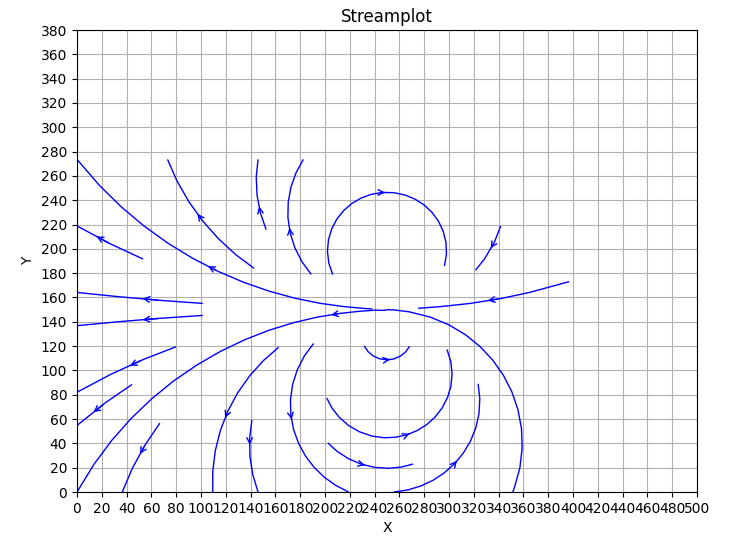

# README

## Overview

This project provides a tool for generating synthetic 2D flow field particle image pairs and corresponding flow field datasets, primarily for optical flow training. The default image size is \((H, W) = (384, 512)\). The generated data follows the format:

```
0011
 {picture_1_0.png picture_2_0.png flow_0.h5},
 0002
 {picture_1_1.png picture_2_1.png flow_1.h5},
 ...
```

## Flow Field Generation

Flow fields can be generated either by specifying analytical formulas or by loading existing flow field data from files.

### Using Analytical Formulas

You can define a flow field using the `--flow_formula` argument, for example:

```python
--flow_formula "3 * \cos\left(\frac{2 \pi x}{250 - 0.3 y}\right) * \sin\left(\frac{2 \pi y}{250 - 0.3 y}\right)" \
              "3 * \sin\left(\frac{2 \pi x}{250 - 0.3 y}\right) * \cos\left(\frac{2 \pi y}{250 - 0.3 y}\right)"
```

This defines \([u, v]\), the velocity components of the flow field:

$$
u = 3 \cos \left( \frac{2 \pi x}{250 - 0.3 y} \right) \sin \left( \frac{2 \pi y}{250 - 0.3 y} \right)
$$
$$
v = 3 \sin \left( \frac{2 \pi x}{250 - 0.3 y} \right) \cos \left( \frac{2 \pi y}{250 - 0.3 y} \right)
$$


### Using Predefined Flow Data

Alternatively, you can load existing flow fields from `.h5`, `.bin`, or `.raw` files by specifying `--flow_path`.

---

# Boundary Generation

Boundaries can be generated in two ways:
1. Using binary mask images from the directory specified by `--mask_path`.
2. Defining analytical expressions via `--mask_formula0` and `--mask_formula1`.

### Defining Boundaries with Analytical Expressions
- `--mask_formula0`: Defines the boundary for the first image. Example:
  
  ```python
  --mask_formula0 "(x / 500)^2 + (y / 300)^2 - 1" "x - 400"
  ```
  
  The valid flow field region is determined by solving the inequality \( \{eq_1 < 0, eq_2 < 0, ...\} \).
  
- `--mask_formula1`: Defines the boundary for the second image.
  - If omitted, the second image's boundary is determined by the first image's boundary and the flow field.
  - If specified, the second image's boundary is strictly determined by `--mask_formula1`.

### Computation Process
- Initially, particles in the first image move along the flow field without considering boundaries.
- Then, `--mask_formula0` and `--mask_formula1` are applied to mask particles outside the defined regions and set the flow field to zero outside the combined boundaries.
- If the boundary contains sources or sinks, the flow near the boundary cannot be entirely determined by the velocity field. For example, in cell migration simulations, a compressed 3D cell may exhibit lateral flow at its boundary despite an overall 2D flow assumption.

## Particle Generation and Noise

Particles are randomly distributed in the image and follow a Gaussian intensity profile:

$$
I_0 \exp \left( -8 \frac{(x - x_0)^2 + (y - y_0)^2}{d^2} \right)
$$

where `d` is the particle size (`--d`), and `rho` controls the density (`--rho`). Supported noise types include Gaussian, Poisson, and salt-and-pepper noise.

## GPU Acceleration

The computation of Gaussian intensity spots is the most time-consuming part of the process, so GPU acceleration and parallel processing are utilized.

## Example Usage

To generate a dataset with index 1000, a clipped elliptical boundary, a custom dipole flow field formula, and Gaussian noise, use:

```cmd
python data_generator.py --mask_formula0 "(x / 500) ** 2 + (y / 300) ** 2 - 1" "x - 400" --flow_formula "-800 * ((x - 250)**2 - (y - 150)**2) / ((x - 250)**2 + (y - 150)**2 + 0.01)**2" "-2*800 * (x - 250) * (y - 150) / ((x - 250)**2 + (y - 150)**2 + 0.01)**2" --noise_type "gaussian" --index 1000
```


## Batch Processing

The `batch_generator.py` script allows the bulk generation of datasets, incorporating predefined flow fields, boundaries, and random perturbations.


---

# 说明文档

## 概述

本项目提供了一种工具，用于生成二维流场的合成粒子图像对及对应的流场数据集，主要用于光流法的训练。默认图像大小为 \((H, W) = (384, 512)\)。生成的数据格式如下：

```
0011
 {picture_1_0.png picture_2_0.png flow_0.h5},
 0002
 {picture_1_1.png picture_2_1.png flow_1.h5},
 ...
```

## 流场生成

流场可以通过解析式生成，也可以从文件中读取已有的流场数据。

### 通过解析式生成

可使用 `--flow_formula` 参数定义流场，例如：

```python
--flow_formula "3 * \cos\left(\frac{2 \pi x}{250 - 0.3 y}\right) * \sin\left(\frac{2 \pi y}{250 - 0.3 y}\right)" \
              "3 * \sin\left(\frac{2 \pi x}{250 - 0.3 y}\right) * \cos\left(\frac{2 \pi y}{250 - 0.3 y}\right)"
```

这定义了流场速度分量 \([u, v]\)：

$$
u = 3 \cos \left( \frac{2 \pi x}{250 - 0.3 y} \right) \sin \left( \frac{2 \pi y}{250 - 0.3 y} \right)
$$
$$
v = 3 \sin \left( \frac{2 \pi x}{250 - 0.3 y} \right) \cos \left( \frac{2 \pi y}{250 - 0.3 y} \right)
$$


### 读取已有流场数据

可以使用 `--flow_path` 指定 `.h5`、`.bin` 或 `.raw` 格式的流场文件。

# 边界生成 (Boundary Generation)

边界可以通过两种方式生成：
1. 读取 `--mask_path` 指定文件夹中的二值掩膜图片。
2. 使用 `--mask_formula0` 和 `--mask_formula1` 定义解析式。

### 使用解析式定义边界
- `--mask_formula0`：定义第一张图片的边界，例如：
  
  ```python
  --mask_formula0 "(x / 500)^2 + (y / 300)^2 - 1" "x - 400"
  ```
  
  其有效区域由解不等式 \( \{eq_1 < 0, eq_2 < 0, ...\} \) 决定。
  
- `--mask_formula1`：定义第二张图片的边界。
  - 若未指定，则第二张图片的边界由第一张图片的边界和流场共同决定。
  - 若指定，则第二张图片的边界完全由 `--mask_formula1` 确定。

### 计算过程
- 计算时，首先假设没有边界，让第一张图片的粒子沿流场运动得到第二张图片。
- 然后分别根据 `--mask_formula0` 和 `--mask_formula1` 进行掩膜计算，去除边界外的粒子，并将边界外的流场置零。
- 当掩膜对应的边界存在源或汇时，边界流动无法仅由流场决定。例如，在细胞流动场景下，三维细胞被压缩为二维流动时，边界仍可能存在侧向流动。

## 粒子生成与噪声

粒子随机分布于图像中，并遵循高斯强度分布：

$$
I_0 \exp \left( -8 \frac{(x - x_0)^2 + (y - y_0)^2}{d^2} \right)
$$

其中 `d` 为粒子大小 (`--d`)，`rho` 控制粒子密度 (`--rho`)。支持的噪声类型包括高斯噪声、泊松噪声和盐椒噪声。

## GPU 加速

计算高斯亮斑是最耗时的部分，因此采用 GPU 加速和并行处理。

##使用示例：

要生成一个序号为1000，具有被切割椭圆边界和自定义偶极流场公式的数据集，并加入高斯噪声，请使用：

```cmd
python data_generator.py --mask_formula0 "(x / 500) ** 2 + (y / 300) ** 2 - 1" "x - 400" --flow_formula "-800 * ((x - 250)**2 - (y - 150)**2) / ((x - 250)**2 + (y - 150)**2 + 0.01)**2" "-2*800 * (x - 250) * (y - 150) / ((x - 250)**2 + (y - 150)**2 + 0.01)**2" --noise_type "gaussian" --index 1000
```


## 批量处理

`batch_generator.py` 脚本可用于批量生成数据集，包含预定义流场、边界以及随机扰动。
